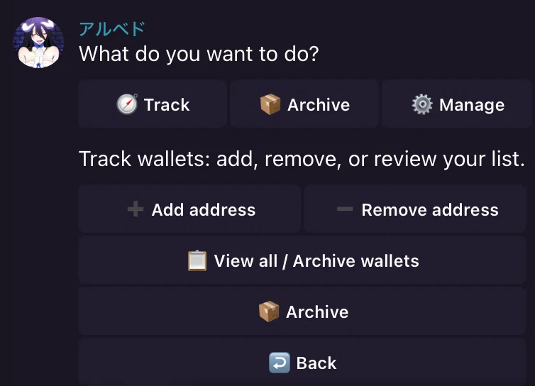
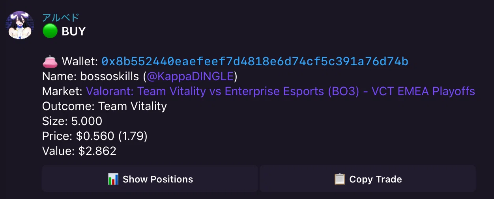
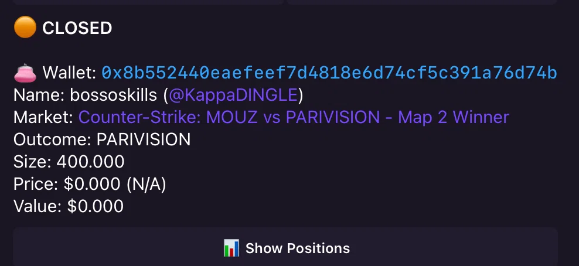
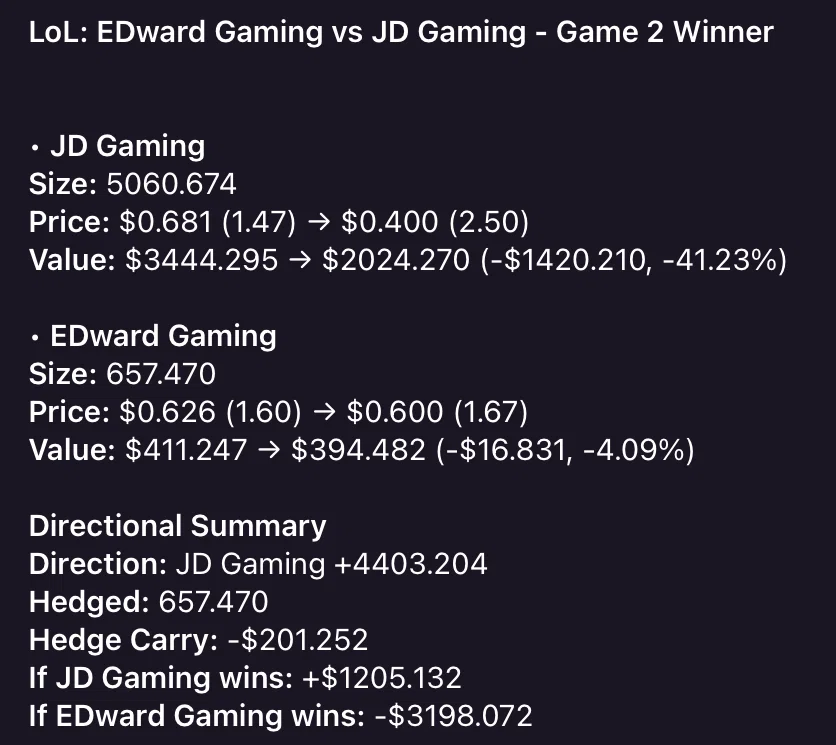

# Albedo

Personal Telegram bot because the Polymarket UI sucks.

## Features

- **Track wallets**: Monitor any wallet's activity and position changes
- **Archive wallets**: Save addresses and labels without monitoring them
- **Manage wallets**: Store encrypted private keys to place orders directly from Telegram
- Real-time notifications for trades and position updates

## Screenshots

<p align="center">
  
  &nbsp;&nbsp;
  
</p>

<p align="center">
  
  &nbsp;&nbsp;
  
</p>

## Requirements

- Rust (1.88+)
- SQLite

## Setup

1. Clone the repository:
   ```bash
   git clone https://github.com/0xfinder/albedo.git
   cd albedo
   ```

2. Create a `.env` file:
   ```bash
   cp .env.example .env
   ```

3. Configure environment variables in `.env`:
   ```env
   # Required
   TELEGRAM_TOKEN=your_telegram_bot_token

   # Required - comma-separated Telegram user IDs allowed to use the bot.
   # Unset or empty locks the bot down; there is no open-access mode.
   # Message @userinfobot on Telegram to find your ID.
   ALLOWED_TELEGRAM_IDS=your_telegram_user_id

   # Optional - defaults to sqlite://bot.db
   DATABASE_URL=sqlite://bot.db

   # Optional - polling interval in seconds (default: 1, supports decimals like 0.5; 0 disables polling)
   POLYMARKET_DATA_POLL_SECONDS=1

   # Optional - for encrypting managed wallet private keys
   # Generate with: openssl rand -hex 32
   ENCRYPTION_KEY=your_64_char_hex_key
   ```

4. Restrict access to secrets (the encryption key in `.env` can decrypt the
   keys stored in `bot.db`, so both files should be owner-readable only):
   ```bash
   chmod 600 .env bot.db
   ```
   Keep `.env` out of any backups you make of `bot.db`.

5. Build and run:
   ```bash
   cargo build --release
   cargo run --release
   ```

## Usage

Start a conversation with your bot on Telegram and use `/start` to see the menu.

### Track Mode
- Add wallet addresses to monitor
- Receive notifications when tracked wallets make trades

### Archive Mode
- Open `/archive` or tap **Archive** in the main menu
- Use **Archive address**, send an `0x...` address, then add a label or tap **Skip label**
- Archiving an existing tracked address stops monitoring it. Skipping the label keeps its existing label
- In the tracked wallet list, tap **Archive** to save a wallet with one tap
- In **View archive**, tap **Start tracking** to restore monitoring. Activity from the archived period is not replayed; the next poll establishes a fresh baseline
- Use **Delete address** to remove a saved wallet from the archive

### Manage Mode
- Authenticate with your private key (encrypted and stored locally)
- View positions and place market/limit orders
- Cancel orders directly from Telegram

## Testing

Run the test suite:
```bash
cargo test
```
